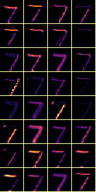
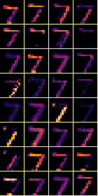
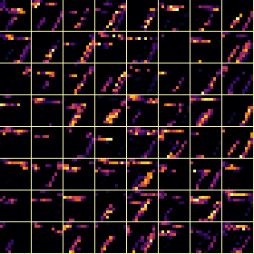
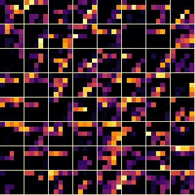
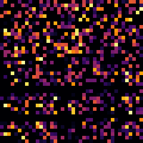

# MNIST
A recreation of the MNIST convolutional neural network.

## Background

### MNIST

MNIST stands for Modified National Institute of Standards and Technology. It is a dataset consisting of 28x28 grayscale hand written images. See an example image below on the left along with a representation which displayes the 8-bit grayscale decimal values on the right.


A neural network consisting of two convolutional to max pooling layers has been trained to classify each image as a decimal from 0-9. See details relaiting to each layer below. Each output image has been scaled up and color mapped for easier viewing.

| Layer | Description | Output |
| --- | --- | --- |
| Input | Input layer which takes the original 28x28 image |  |
| convolutional 1 | First convolutional layer which applies a 3x3 kernel and produces 32 26x26 convolutions |  |
| Max Pooling 1 | First Mmx pooling layer which reduces the 32 26x26 convolutions into 32 13x13 max convolutions |  |
| convolutional 2 | Second convolutional layer which applies a 3x3 kernel and produces 64 11x11 convolutions |  |
| Max Pool 2 | Second max pooling layer which reduces the 64 11x11 images to 64 5x5 max convolutions |  |
| Flatten | Flattening layer which flattens the 64 5x5 images into a 1 dimensional array of length 1600 displayed to right reshapen into a 40x40 image |  |
| Dropout | Dropout layer |  |
| Dense | Dense layer which reduces the 1x1600 array into a 1x10 classificaiton representing the digits 0-9 |  |


---

## Usage

```
usage: MNIST [-h] {display,predict,retrain} ...

Implementation of the MNIST CNN

positional arguments:
  {display,predict,retrain}
                        command to execute
    display             Display the MNIST image with the given id
    predict             Predict the value of the MNIST image with the given id
    retrain             Retrain the model

options:
  -h, --help            show this help message and exit


usage: MNIST display [-h] [--train] [-s] [id]

positional arguments:
  id          ID of the MNIST image to display, randomized if not provided

options:
  -h, --help  show this help message and exit
  --train     Flag to specify using the train dataset instead of the test dataset
  -s, --save  Flag to save the image file in the current directory


usage: MNIST predict [-h] [--train] [-d] [id]

positional arguments:
  id             ID of the MNIST image to predict, randomized if not provided

options:
  -h, --help     show this help message and exit
  --train        Flag to specify using the train dataset instead of the test dataset
  -d, --display  Flag to display the image with prediction


usage: MNIST retrain [-h] [-s]

options:
  -h, --help  show this help message and exit
  -s, --save  Flag to save the retrained model
```

---

## Project Sutructure

```
├── MNIST
│   ├── assets
│   ├── data
│   │   ├── mnist_test.csv
│   │   ├── mnist_train1.csv
│   │   └── mnist_train2.csv
│   ├── model
│   ├── src
│   │   ├── config.py
│   │   ├── extract.py
│   │   ├── main.py
│   │   ├── model.py
│   │   ├── preProcess.py
│   │   └── reTrain.py
│   └── README.md
```

| File | Description |
| --- | --- |
| assets/ | Images used for README | 
| data/mnist_test.csv | csv containing the test MNIST dataset. column 1 contains the classification. columns 1-785 contain 8bit grayscale image pixel values |
| data/mnist_train1.csv | csv containing the first half of train MNIST dataset. column 1 contains the classification. columns 1-785 contain 8bit grayscale image pixel values |
| data/mnist_train2.csv | csv containing the second half of train MNIST dataset. column 1 contains the classification. columns 1-785 contain 8bit grayscale image pixel values |
| model/ | files storing the model, produced by Keras |
| src/config.py | configuration file |
| src/extract.py | Function to extract data from MNIST csv files |
| src/main.py | main cli function |
| src/model.py | definition for untrained model |
| src/preProcess.py | image data preprocessing function |
| src/reTrain.py | function to retrain the model and display training data |
| README.md | this README file |
